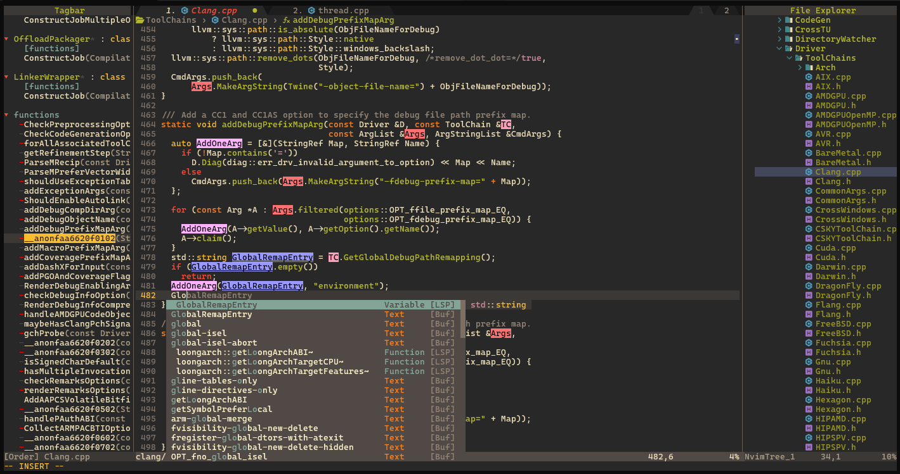

<div align="center">
  
  <p>
    <span style="color: #4EC9B0">N</span><span style="color: #569CD6">E</span><span style="color: #9CDCFE">O</span><span style="color: #C586C0">V</span><span style="color: #DCDCAA">I</span><span style="color: #F44747">M</span>
    <span style="display: inline-block; width: 20px"></span>
    <span style="color: #888">|</span>
    <span style="display: inline-block; width: 20px"></span>
    <span style="color: #FF79C6">Hyperextensible Vim-based Text Editor</span>
  </p>
  <pre>
  <span style="color: #4EC9B0">███╗   ██╗███████╗ ██████╗ ██╗   ██╗██╗███╗   ███╗</span>
  <span style="color: #569CD6">████╗  ██║██╔════╝██╔═══██╗██║   ██║██║████╗ ████║</span>
  <span style="color: #9CDCFE">██╔██╗ ██║█████╗  ██║   ██║██║   ██║██║██╔████╔██║</span>
  <span style="color: #C586C0">██║╚██╗██║██╔══╝  ██║   ██║╚██╗ ██╔╝██║██║╚██╔╝██║</span>
  <span style="color: #DCDCAA">██║ ╚████║███████╗╚██████╔╝ ╚████╔╝ ██║██║ ╚═╝ ██║</span>
  <span style="color: #F44747">╚═╝  ╚═══╝╚══════╝ ╚═════╝   ╚═══╝  ╚═╝╚═╝     ╚═╝</span>
  </pre>
</div>



### 还需要手动安装的模块：

```bash
~/.fzf/

#插件
fzf-lua
hlchunk.nvim
nvim-autopairs
gruvbox-material
tagbar
vim-cpp-enhanced-highlight

```

### 需要额外进行的操作：
```
~/.local/share/nvim/mason/ 下面的软连接都会失效，需要重新ln -s

#Eg：clangd bin文件
 #软连接
    .local/share/nvim/mason/bin/clangd -> /home/ljc/.local/share/nvim/mason/packages/clangd/clangd_20.1.0/bin/clangd
 #只有clangd需要下载bin文件
    .local/share/nvim/mason/packages/clangd/clangd_20.1.0/bin/clangd*
```

### 备选：
```
aerial.nvim

playground
nvim-treesitter
nvim-treesitter-context

```
