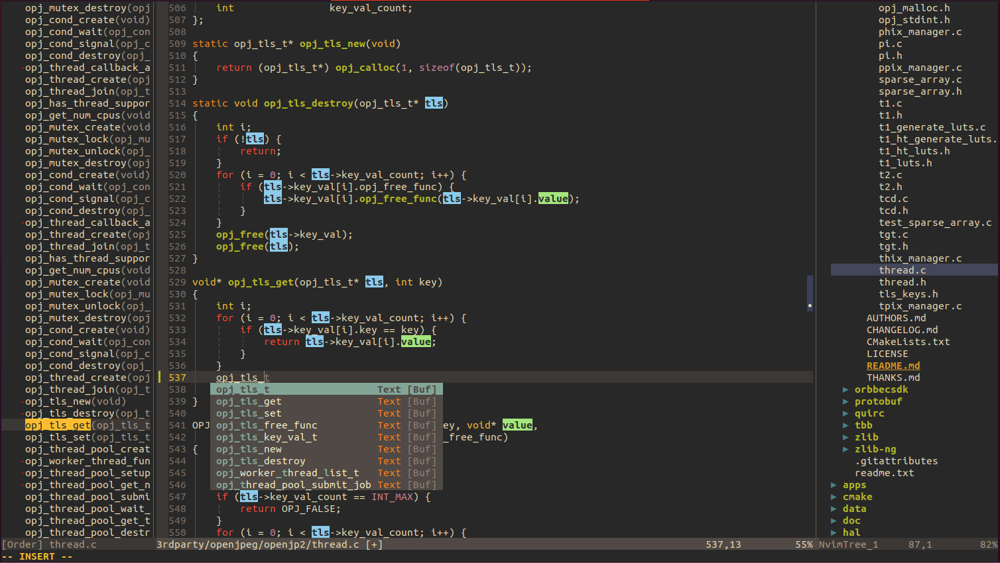

<div align="center">
  <pre>
  <span style="color: #4EC9B0">███╗   ██╗███████╗ ██████╗ ██╗   ██╗██╗███╗   ███╗</span>
  <span style="color: #569CD6">████╗  ██║██╔════╝██╔═══██╗██║   ██║██║████╗ ████║</span>
  <span style="color: #9CDCFE">██╔██╗ ██║█████╗  ██║   ██║██║   ██║██║██╔████╔██║</span>
  <span style="color: #C586C0">██║╚██╗██║██╔══╝  ██║   ██║╚██╗ ██╔╝██║██║╚██╔╝██║</span>
  <span style="color: #DCDCAA">██║ ╚████║███████╗╚██████╔╝ ╚████╔╝ ██║██║ ╚═╝ ██║</span>
  <span style="color: #F44747">╚═╝  ╚═══╝╚══════╝ ╚═════╝   ╚═══╝  ╚═╝╚═╝     ╚═╝</span>
  </pre>
</div>



### PS:
```
NvimLua 配置简化版本，关闭lsp支持
稳定、快捷、轻编辑
```

### TODO:

```bash
1.解压插件/字体
  tar -xJvf fzf.tar.xz -C ~/

  cd ~/.local/share/nvim/ 
  tar -xJvf lazy.tar.xz 

  cd ~/.local/share/fonts/
  tar -xJvf UbuntuMono.tar.xz -C UbuntuMono
  fc-cache -fv

2.若放开LSP，则clangd 需要手动安装
  放到：.local/share/nvim/mason/packages/clangd/clangd_20.1.0/bin/
  更新软连接:
  ln -s ~/.local/share/nvim/mason/packages/clangd/clangd_20.1.0/bin/clangd ~/.local/share/nvim/mason/bin/clangd
  ln -s ~/.local/share/nvim/mason/packages/clangd/mason-schemas/lsp.json   ~/.local/share/nvim/mason/share/mason-schemas/lsp/clangd.json
```

